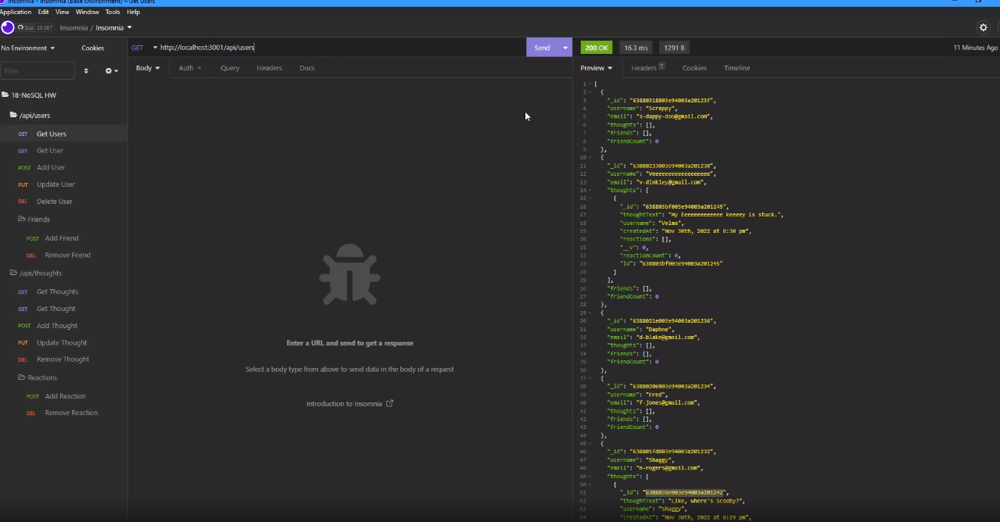

# Social-Network-Api

## Description

A back end application that uses an unstructured database to store and manipulate social media data.

Data including users, friends lists, thoughts, and responses to the thoughts.

## Installation

1. Download the files

2. From the command line in the same folder as index.js run `npm init`

## Usage

Run the application from the command line in the folder index.js is in. Run it with the command: npm start.

## Screenshot

## Tutorial Video

## Built With

- JavaScript
- MongoDB
- NodeJS
- express.js
- mongoose.js

## Questions

If you have any questions, please contact at [GitHub/JonathanGibbings](https://github.com/JonathanGibbings/).
